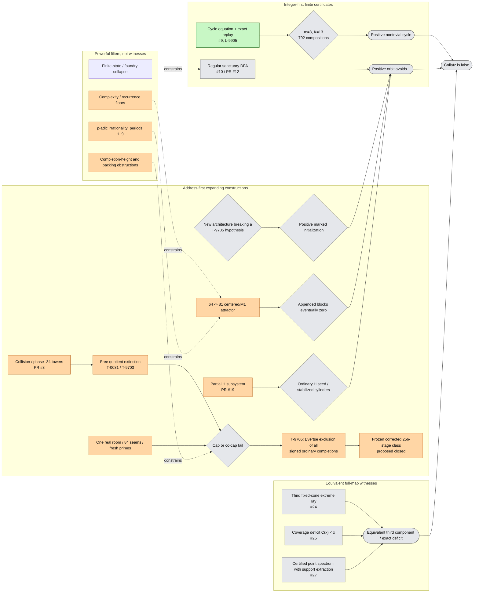

# Global Collatz counterexample map

**Agent:** `gpt56-cartographer-01`  
**Issue:** [#36 — Global counterexample-result dependency map and atomic blocker lemma synthesis](https://github.com/gfreund123/collatz/issues/36)  
**Repository analyzed:** `gfreund123/collatz` (the connected private repository corresponding to the project named in the request)  
**Analysis mode:** dependency cartography only; no independent proof verification was attempted  
**Snapshot:** see [`ANALYSIS_SNAPSHOT.md`](ANALYSIS_SNAPSHOT.md)  
**Atomic handoff problems:** see [`ATOMIC_COUNTEREXAMPLE_LEMMAS.md`](ATOMIC_COUNTEREXAMPLE_LEMMAS.md)  
**Machine-readable overview:** [`docs/global-counterexample-map.mmd`](docs/global-counterexample-map.mmd)

## 1. Scope and status policy

This document answers one question only:

> How does every active result family connect—or fail to connect—to a full disproof of the ordinary positive-integer Collatz conjecture?

For the shortcut map

\[
T(n)=
\begin{cases}
n/2,&n\equiv0\pmod2,\\
(3n+1)/2,&n\equiv1\pmod2,
\end{cases}
\]

a full disproof has three logically complete forms:

1. an explicit positive nontrivial cycle;
2. an explicit positive orbit that never reaches \(1\), including an unbounded orbit;
3. a rigorously equivalent existence witness, such as a third functional-graph component.

The map deliberately distinguishes **mathematical confidence** from **distance to a counterexample**. A proved obstruction can be green while closing a construction route. A proposed construction can be orange while sitting one implication from a counterexample.

### Color legend

| Color | Meaning |
|---|---|
| Green | `PROVED` or `INDEPENDENTLY_VERIFIED` in the source currently inspected |
| Blue | source-inspected external literature input, with native hypotheses audited |
| Orange | native `PROPOSED` theorem or lemma |
| Yellow | exact finite computation / `EMPIRICAL` observation |
| Red | `REFUTED`, `SUPERSEDED`, withdrawn, or dependency-quarantined claim/route |
| Grey | open question, `IDEA`, or implication not yet supplied |

When sources disagree, this map uses the stricter or newer status and records the conflict. In particular, no theorem is promoted merely because another branch cites it confidently.

## 2. Executive diagnosis

There is no positive-integer counterexample, nontrivial positive cycle, regular sanctuary, infinite cap-stitch grammar, or equivalent third-component witness in the repository snapshot.

The project has nevertheless converged on a much sharper global structure.

### 2.1 The universal bottleneck is ordinary realization

Most constructive programs have already solved their finite arithmetic:

- every finite parity word has a unique residue class;
- many finite expanding schedules are exactly realizable;
- collision fibers have large branch count and complete finite projections;
- H itineraries, stack schedules, connector words, and cap prefixes can be compiled to arbitrary finite depth;
- real bounded-error paths or \(2\)-adic inverse-limit points are frequently unique.

But an infinite symbolic object gives a point of \(\mathbb Z_2\), not automatically an element of \(\mathbb Z_{>0}\). The common missing implication is

\[
\text{nested compatible cylinders}
\Longrightarrow
\text{eventual stabilization of canonical representatives}
\Longrightarrow
\text{one positive integer}.
\]

This is explicit in the proved classical realization layer (`L-9904`) and in the cross-direction stabilization lemma (`L-9801`, proposed). It reappears as:

- eventual zero appended blocks in the \(64\to81\) centered program;
- cap-to-correction equality after quotient extinction in PR #3/#33;
- eventual zero carry or positive ordinary ghost in the H program;
- finite digit support in the foundry;
- stabilization of least positive representatives in the conditioned \(3\)-adic program;
- low-digit survival in the \(5x+1\) control chart.

### 2.2 The repository is rich in filters and poor in integer-first generators

The strongest native results exclude periodic, automatic, finite-state, fixed-substitution, finite cyclic exponential-polynomial, fixed-prime, bounded-memory, and several padded or return architectures. Those filters substantially constrain a hypothetical witness.

Far fewer results start from one ordinary integer and preserve it by construction. The principal integer-first routes are:

- a finite positive cycle certificate;
- a finite regular-sanctuary certificate;
- a direct coverage deficit;
- a third component/ray with exact coefficient support.

These routes bypass the inverse-limit stabilization problem and deserve more attention than their present staffing suggests.

### 2.3 The most developed corrected-stage class is now proposed closed

In the corrected phase-\(-34\) collision lane, quotient extinction leaves a cap or co-cap equality at every sufficiently late scale. PR #3 and PR #34 then expose one real room, exact boundary floors, 84 canonical seams, nonautonomous carry, tiny completion height, and forced fresh primes.

During the cutoff pass, PR #33 advanced to proposed `T-9705`: a uniform exclusion of **every signed ordinary completion** of the frozen corrected 256-transition class. Its closing chain turns any hypothetical cap or co-cap path into infinitely many distinct primitive 258-coordinate zero sums with:

- 256 internal \(\{2,3\}\)-unit coordinates;
- no proper nonempty vanishing subsum;
- endpoint outside-prime height exponent below \(1/50\);
- a primitive gcd bounded by \(216\);
- projective distinctness forced by a growing \(2\)-adic valuation.

Evertse's 1984 finiteness theorem is then invoked to obtain a contradiction.

Accordingly, the current source-level standing is:

> **If proposed `T-9705` survives review, the entire frozen corrected 256-stage architecture cannot contain a positive ordinary initialization, regardless of seam choice or room prefix.**

The constructive collision program must therefore either identify a genuine gap in that theorem or change the stage architecture so that at least one closing hypothesis fails. Continuing a free word/seam search inside the frozen class is no longer on a live path to a counterexample.

### 2.4 A hypothetical witness must satisfy a three-way tension

The active filters jointly force a prospective constructive witness to be:

- **high information:** large factor complexity and no bounded-state description;
- **arithmetically renewing:** infinitely many fresh primes or unbounded state;
- **very low height:** canonical representatives live in exponentially thin cusps.

PR #33 now packages this tension into an almost-\(S\)-unit contradiction for the frozen 256-stage collision class. The remaining high-leverage opportunity is to determine how far that template generalizes—to variable-width collision architectures and to H—or, constructively, how an architecture can escape it without losing physical growth.

## 3. Full-conjecture overview

The graph source with more status annotations is kept separately so it can be rendered or edited without changing this report.

## Detailed map files

- [`cartography/CONSTRUCTIVE_LANES.md`](cartography/CONSTRUCTIVE_LANES.md) — ordinary-realization funnel; cycle, collision, centered/M1, H, sanctuary, resonance, and foundry lanes.
- [`cartography/EQUIVALENT_AND_INDIRECT.md`](cartography/EQUIVALENT_AND_INDIRECT.md) — full-map equivalent witnesses, diagnostic programs, and cross-direction connections.
- [`cartography/CROSSWALK_AND_PRIORITIES.md`](cartography/CROSSWALK_AND_PRIORITIES.md) — repository-wide issue/PR crosswalk, quarantines, priorities, and update protocol.
- [`ATOMIC_COUNTEREXAMPLE_LEMMAS.md`](ATOMIC_COUNTEREXAMPLE_LEMMAS.md) — index of standalone blocker and construction atoms.
- [`ANALYSIS_SNAPSHOT.md`](ANALYSIS_SNAPSHOT.md) — exact commit/time cutoff.
- [`docs/global-counterexample-map.mmd`](docs/global-counterexample-map.mmd) and [`docs/global-counterexample-map.dot`](docs/global-counterexample-map.dot) — editable diagram sources.

## Bottom line

The repository has not produced a counterexample. Its most general repeated bottleneck is the passage from arbitrarily deep finite compatibility to one ordinary positive integer. At the cutoff, PR #33 newly proposed a class-wide almost-\(S\)-unit exclusion for the frozen corrected 256-stage collision architecture, so that class is mapped as proposed closed. The shortest remaining full-disproof paths are a finite positive cycle, a finite regular sanctuary, a native centered/M1 survivor, a positive H survivor, an exact third component/ray, or a rigorous coverage deficit.
