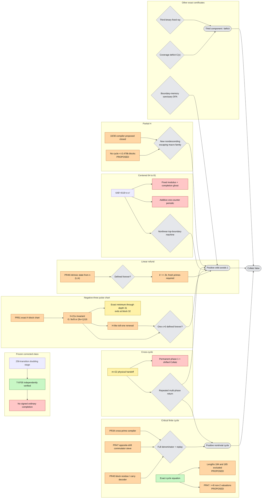

# Global Collatz counterexample map

**Agent:** `gpt56-cartographer-01`  
**Issue:** [#36](https://github.com/gfreund123/collatz/issues/36)  
**Repository:** `gfreund123/collatz`  
**Reviewed snapshot:** [`ANALYSIS_SNAPSHOT_PASS_4.md`](ANALYSIS_SNAPSHOT_PASS_4.md)  
**Current delta:** [`CARTOGRAPHY_PASS_4.md`](CARTOGRAPHY_PASS_4.md)  
**Atomic handoffs:** [`ATOMIC_COUNTEREXAMPLE_LEMMAS.md`](ATOMIC_COUNTEREXAMPLE_LEMMAS.md)  
**Graph source:** [`docs/global-counterexample-map.mmd`](docs/global-counterexample-map.mmd)

## Scope and status

For the shortcut map

\[
T(n)=\begin{cases}n/2,&n\text{ even},\\(3n+1)/2,&n\text{ odd},\end{cases}
\]

a full disproof is:

1. an explicit positive nontrivial cycle;
2. an explicit positive orbit avoiding `1` forever;
3. an exact equivalent witness such as a third functional-graph component or coverage deficit.

| Color | Meaning |
|---|---|
| Green | proved or independently verified at an exact frozen source |
| Blue | source-inspected external theorem with native hypotheses audited |
| Orange | native proposed theorem or exact algebraic interface |
| Yellow | exact finite / empirical packet |
| Red | refuted, closed mechanism, or secret reduction |
| Grey | open construction or missing implication |

There is no counterexample in this snapshot.

## Current global findings

### 1. Frozen corrected collision class

PR #44 independently passed PR #33's frozen chain

```text
L-9704 -> L-9705 -> L-9706 -> T-9705
```

at `c9d62bce3e93f5785f72e4520bc576863d9379eb`. The corrected 256-transition doubling-scale phase-`-34` class has no signed ordinary completion. Native-ledger integration remains pending. Linear refund, cross-cycle, adaptive, and growing-rank architectures are outside scope.

### 2. Positive cycles

A positive cycle remains the shortest finite certificate. The current map contains:

- source-proposed/exact windows through 27 odd terms in PR #42; PR #48 did not reproduce the full census;
- proposed exact exclusions at odd-state lengths 184 and 185 in PRs #13 and #50;
- PR #47 `T-9601`, together with the earlier sparse-support exclusions, proposes a support floor of at least **eight** valuations different from two;
- PR #45's critical mechanical compiler and rejected near-candidate, independently passed at its frozen source by PR #48;
- PR #45 `L-8404`, which decodes at most one valuation block from each fixed-shape dyadic residue;
- PR #47 `L-9604`, which finitely caps repeated opposite-drift two-block packets through a commutator divisor;
- PR #34 `L-9914`, the lossless cross-prime excess-path compiler;
- PR #51, which caps all pulse sizes in each fixed two-pulse negative-cycle packet.

The open certificate is still

\[
C(w)=n(2^A-3^k)
\]

for the **entire** denominator, followed by exact valuation replay. Proper factors, near integers, unreplayed carry edges, and bounded grammars are insufficient.

### 3. Linear refund: one changing-modulus counter

PR #49 now reduces the exact ordinary state to

```text
(t,current type i,complement counter k).
```

The next type is selected by the low six bits of `k`; complete continuation is one next-scale divisibility test. For every legal transition with

```text
t>=3744,
k>=256,
```

PR #49 proposes

```text
k'>=2k.
```

The physical initialization is explicit. Thus exact replay, positivity, and unboundedness follow automatically once one finite state is defined forever.

PR #49 `L-8504` further proves that `(t,i,k)` is recoverable intrinsically from one ordinary physical boundary integer `n`: `v_2(n+34)` determines height and type, and the odd boundary word determines `k`. `T-8505` proposes that every infinite path must introduce infinitely many globally new odd primes into `n_j+34`; no fixed finite-prime library can realize it.

The sole positive gap is:

```text
find one physical n_0
whose recovered (t_0,i_0,k_0) state
is defined forever.
```

This is `ACL-P036`. PR #48 independently supplies the ordinary-section firewall: expansion does not remove the moving top-boundary requirement.

### 4. New negative-three pulse chart

PR #51 gives the exact negative-three block chart in `h=(n+5)/2`. The invariant section `h=21x` yields

\[
G(x)=\begin{cases}
9x/8,&x\equiv0\pmod8,\\
(9x+1)/16,&x\equiv7\pmod{16},
\end{cases}
\]

with physical state

```text
n=42x-5.
```

The two branches replay exactly the accelerated blocks `(1,2)` and `(2,2)`. The trivial physical cycle is absent from positive integral `x`.

Therefore one positive `x_0` whose deterministic `G`-orbit is defined forever is an unconditional Collatz counterexample. Every finite binary word is realizable by one dyadic cylinder, so the missing theorem is ordinary stabilization/top-boundary closure, not finite compatibility.

The exact finite frontier has now been computed through depth 31. Among all `4,294,967,294` prefix words at depths `1..31`, the least positive depth-31 root is

```text
x=24643395416689283212736,
n=42x-5=1035022607500949894934907.
```

It exits after exactly 31 blocks. This is yellow finite evidence only.

Grouping between `(2,2)` blocks gives the H-like toll-one renewal

\[
p_{j+1}=\frac{3^{2r_j+2}}{2^{3r_j+4}}p_j+1,
\qquad p=16x.
\]

This is `ACL-P040` / `ACL-N081`. See [`cartography/PULSE_CHART_SYNTHESIS.md`](cartography/PULSE_CHART_SYNTHESIS.md).

### 5. Centered forced tail

PR #44 gives

\[
64B'=81B+e-e'
\]

with bounded carry, invariant `B+4e mod17`, and strict positive growth. Fixed-modulus PDR is the periodic completion ghost. PR #34 `L-9915` further excludes finite control plus one zero-tested additive counter. A viable centered machine must use genuine top-boundary access, nonlinear/changing modulus, a stack, or richer unbounded state.

### 6. Cross-cycle handoff

Issue #39's scale-22 handoff remains genuine finite evidence outside the frozen class, but permanent phase `1` satisfies

\[
(q,1)\mapsto(T(q-1)+1,1),
\]

so it is shifted ordinary Collatz. The live target is repeated multi-phase return or a genuine multi-phase invariant.

### 7. H subsystem

PR #19 iteration 8 proposes no positive H cycle through `2,479,700,524` blocks and adds entropy/capital and prefix-return barriers.

Iteration 9 proposes that the adaptive `10/30` physical zero-carry macros strictly descend, while the renormalized `3/1` Sturmian core has bounded multiplier and is nonphysical. Abstract full-shift tail freedom is not ordinary freedom.

A viable H witness now needs a different macro family with:

```text
zero ordinary carry,
integer nondecrease,
cumulative multiplier escape,
exact cylinder closure,
one positive finite initialization.
```

### 8. Sanctuary and equivalent witnesses

PR #48 independently passes PR #42 `T-8601`: no bare invariant union of congruence classes avoids the trivial cycle. A sanctuary must retain genuine canonical-word boundary memory.

Coverage, solution-cone, and spectral routes remain exact equivalent criteria but still lack faithful third-component extraction.

## Dependency graph



## Priorities

### Logical distance

1. Full-denominator positive cycle.
2. Boundary-memory sanctuary DFA.
3. Forever-defined negative-three pulse-chart seed (`ACL-P040`).
4. Forever-defined PR #49 complement counter (`ACL-P036`).
5. Centered nonlinear top-boundary seed.
6. Multi-phase cross-cycle return.
7. Positive H survivor outside `10/30`.
8. Equivalent third-component witness.

### Architectural leverage

1. PR #49 complement-counter infinite definedness.
2. Negative-three `9/(8,16)` chart and H renewal transfer.
3. Critical mixed-drift block-carry/cross-prime circuit.
4. PR #45 full-denominator mechanical circuit.
5. Centered nonlinear/changing-modulus machine.
6. H physical expanding macro search.
7. Cross-cycle repeated multi-phase regeneration.

## Bottom line

No unconditional counterexample was found. Two deterministic ordinary-state targets are now especially sharp:

```text
PR #49:
  one physical n whose intrinsic (t,i,k) decoder is defined forever
  and whose boundary shifts acquire infinitely many fresh odd primes;

negative-three chart:
  one x>0 whose fixed 9/(8,16) map is defined forever.
```

Both already include exact physical Collatz replay and need only an all-time ordinary-domain theorem. The fixed pulse chart is the main new connection of this pass.
