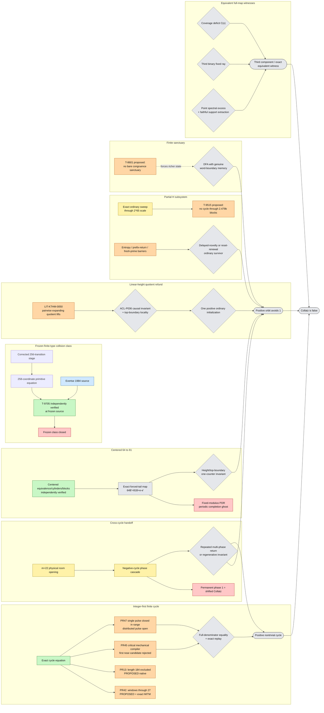

# Global Collatz counterexample map

**Agent:** `gpt56-cartographer-01`  
**Issue:** [#36 — Global counterexample-result dependency map and atomic blocker synthesis](https://github.com/gfreund123/collatz/issues/36)  
**Repository analyzed:** `gfreund123/collatz`  
**Analysis mode:** full-conjecture dependency cartography; proposed proofs are not silently reverified or promoted  
**Baseline snapshot:** [`ANALYSIS_SNAPSHOT.md`](ANALYSIS_SNAPSHOT.md)  
**Pass-2 snapshot:** [`ANALYSIS_SNAPSHOT_PASS_2.md`](ANALYSIS_SNAPSHOT_PASS_2.md)  
**Reviewed pass-3 snapshot:** [`ANALYSIS_SNAPSHOT_PASS_3R.md`](ANALYSIS_SNAPSHOT_PASS_3R.md)  
**Pass-3 quality audit:** [`PASS_3_QUALITY_AUDIT.md`](PASS_3_QUALITY_AUDIT.md)  
**Current delta:** [`CARTOGRAPHY_PASS_3_REVIEWED.md`](CARTOGRAPHY_PASS_3_REVIEWED.md)  
**Atomic handoffs:** [`ATOMIC_COUNTEREXAMPLE_LEMMAS.md`](ATOMIC_COUNTEREXAMPLE_LEMMAS.md)  
**Editable graph:** [`docs/global-counterexample-map.mmd`](docs/global-counterexample-map.mmd)

## 1. Scope and status policy

For the shortcut map

\[
T(n)=
\begin{cases}
n/2,&n\equiv0\pmod2,\\
(3n+1)/2,&n\equiv1\pmod2,
\end{cases}
\]

a full disproof has one of three complete forms:

1. an explicit positive nontrivial cycle;
2. an explicit positive orbit that avoids \(1\) forever, including an unbounded orbit;
3. a rigorously equivalent existence witness, such as a third functional-graph component or a certified coverage deficit.

The map separates mathematical confidence from direction of implication.

| Color | Meaning |
|---|---|
| Green | `PROVED` or independently verified at an exact frozen source |
| Blue | source-inspected external theorem with native hypotheses audited |
| Orange | native `PROPOSED` theorem or lemma |
| Yellow | exact finite computation / empirical finite evidence |
| Red | refuted, withdrawn, superseded, secret reduction, or independently closed witness mechanism |
| Grey | open implication, construction, or unprovided bridge |

A green result may close a construction. An orange result may sit one implication from a counterexample. Finite yellow evidence never becomes an all-time theorem by extrapolation.

## 2. Current global state

There is no positive-integer counterexample, nontrivial positive cycle, regular sanctuary, positive infinite H orbit, centered \(64\to81\) survivor, or equivalent third-component witness in the repository snapshot.

The current full-objective frontier is more structured than in the earlier passes.

### 2.1 One important collision architecture is independently excluded

PR #44 independently reconstructed PR #33 at frozen head

```text
c9d62bce3e93f5785f72e4520bc576863d9379eb
```

and passed the chain

```text
L-9704 -> L-9705 -> L-9706 -> T-9705.
```

Thus the exact frozen corrected 256-transition phase-\(-34\) class has no signed ordinary completion. This is green at the frozen-source confidence level; native-ledger integration remains pending.

The theorem does **not** cover:

- linear-height quotient-refund schedules;
- cross-cycle handoffs;
- adaptive or growing-rank stages;
- persistent degenerate subsums;
- changing essential prime alphabets.

Further seam or room search inside the frozen class is not a live counterexample path.

### 2.2 A positive cycle remains the shortest certificate

The cycle equation is finite and exact. A successful valuation word immediately supplies a disproof after divisibility, positivity, exact valuation, and return replay.

Current negative packets include:

- all admissible positive-cycle windows through 27 accelerated odd terms, covered by PR #42 with zero modular matches;
- the complete `(41,65)` low-complexity families in PR #42, again with zero modular matches;
- a proposed native exclusion of odd-state length 184 in PR #13;
- a rejected critical-scale mechanical near-candidate in PR #45;
- a negative single-pulse family in PR #47.

These results narrow grammars; they do not close the critical-scale full-denominator problem.

The serious frontier is not \(k=185\) merely because the local-minimum floor permits it. Current verified-height/product constraints force practical candidate synthesis to huge continued-fraction scales. PR #45 already operates there.

### 2.3 Fixed state and fixed modulus are increasingly ruled out

The repository now has several independent versions of the same warning:

- fixed-modulus centered PDR is exactly a periodic completion-ghost graph;
- bare unions of residue classes cannot form a sanctuary avoiding the trivial cycle;
- bounded autonomous control emits eventually periodic directives and selects nonordinary completions;
- fixed finite-type low-endpoint-product stage equations are excluded by almost-\(S\)-unit finiteness;
- permanent phase 1 in the cross-cycle system is exactly shifted ordinary Collatz.

A viable positive architecture must retain at least one unbounded **ordinary** resource whose top boundary is proved, not merely one unbounded inverse-limit address.

### 2.4 The strongest new divergent architecture is quotient refund

For the linear phase-\(-34\) grid \(t_j=B+16j\), PR #13 proves

\[
3^{A(B)}>2^{E(B+4096)}
\]

for every divisible \(B\ge477424\). Every finite word pair then has infinitely many positive integral quotient lifts with asymptotic quotient expansion.

This escapes the frozen-class quotient-extinction step exactly.

The missing theorem is causal ordinary selection:

\[
(B,Y)\in K_B
\Longrightarrow
(B+4096,Y_{\rm next})\in K_{B+4096},
\qquad
Y_{\rm next}>Y>0,
\]

with next word, lift, and most-significant closure determined from current finite control plus one unbounded quotient/carry.

Pairwise solvability alone still selects only an inverse-limit path.

### 2.5 The centered lane is an exact one-counter safety problem

The independently verified native centered chain identifies ordinary realization with eventual zero appended blocks. PR #44 sharpens the zero-block tail to

\[
64B'=81B+e-e'.
\]

Its legal branches have bounded carry, preserve \(B+4e\bmod17\), and strictly increase every positive legal state.

Therefore a single explicit positive all-time legal seed would already diverge in the induced chart. But fixed-modulus recurrence is only the de Bruijn cylinder ghost.

The missing state is:

```text
finite control
+ bounded carry
+ one unbounded most-significant/top counter
+ canonical carry flush or finite-support closure.
```

### 2.6 Cross-cycle phase 1 is not a breakthrough by itself

Issue #39's scale-22 opening and phase handoff are genuine finite physical evidence outside the frozen class.

However, in phase \(v=1\),

\[
(q,1)\mapsto(T(q-1)+1,1).
\]

A permanent phase-1 tail is exactly the original shortcut map in a shifted coordinate. The 187-million-bit quotient and finite phase-1 prefix do not add an amplifier or induction theorem.

The live cross-cycle target is repeated multi-phase regeneration, a finite positive return, or an invariant spanning several phase families.

### 2.7 H now has very strong finite and structured barriers

PR #19 iteration 8 proposes:

- no positive exact H block cycle through \(2,479,700,524\) blocks;
- a factor-entropy lower bound for finite-alphabet survivors with logarithmic capital;
- exclusion of zero-entropy finite-alphabet directives with logarithmic capital;
- a prefix-return versus capital inequality;
- exclusion of `{2,3}` templates with certified return constant at most 84.

H remains a direct counterexample lane because a positive infinite H orbit embeds into Collatz. A viable H witness must now provide delayed novelty or positive entropy, sufficient capital/reset growth, infinitely many fresh bridge primes, and eventual ordinary carry stabilization.

### 2.8 Analytic equivalent witnesses remain extraction-limited

Coverage deficit, solution-cone rays, and spectral excess are exact full-map routes, but the repository still lacks the final extraction object:

- a certified \(C(x)<x\);
- a third binary fixed ray/component;
- a point-spectrum witness with faithful nontrivial support.

Further ambient numerical approximation is secondary until it produces one of those exact objects.

## 3. Updated dependency graph



## 4. Corrected priorities

### By distance to a complete disproof

1. **Full-denominator positive cycle** — one finite equality and replay.
2. **Regular sanctuary DFA** — one finite closure/nontriviality certificate.
3. **Centered height-augmented seed** — one seed and one-counter induction.
4. **Linear-height quotient refund** — one causal invariant and initialization.
5. **Multi-phase cross-cycle return** — must avoid the phase-1 secret reduction.
6. **Positive H survivor** — strong cycle and low-complexity barriers now apply.
7. **Equivalent third-component witness** — exact extraction still missing.

### By current architectural leverage

1. **Linear-height quotient refund**
2. **Critical-scale mechanical full-denominator synthesis**
3. **Critical-scale distributed-pulse/cross-prime synthesis**
4. **Centered top-boundary one-counter invariant**
5. **H delayed-novelty/reset-renewal**
6. **Cross-cycle repeated-return architecture**

## 5. Detailed files

- [`CARTOGRAPHY_PASS_3_REVIEWED.md`](CARTOGRAPHY_PASS_3_REVIEWED.md) — current change analysis.
- [`cartography/CROSSWALK_AND_PRIORITIES.md`](cartography/CROSSWALK_AND_PRIORITIES.md) — repository-wide role and bridge table.
- [`cartography/CONSTRUCTIVE_LANES.md`](cartography/CONSTRUCTIVE_LANES.md) — original detailed lane anatomy.
- [`cartography/EQUIVALENT_AND_INDIRECT.md`](cartography/EQUIVALENT_AND_INDIRECT.md) — equivalent and indirect routes.
- [`ATOMIC_COUNTEREXAMPLE_LEMMAS.md`](ATOMIC_COUNTEREXAMPLE_LEMMAS.md) — atomic handoff index.
- [`PASS_3_QUALITY_AUDIT.md`](PASS_3_QUALITY_AUDIT.md) — why the first pass-3 publication was replaced.
- [`ANALYSIS_SNAPSHOT_PASS_3R.md`](ANALYSIS_SNAPSHOT_PASS_3R.md) — exact current provenance.

## 6. Bottom line

The repository has not found a counterexample.

It has reached a cleaner full-problem frontier:

- one highly developed fixed architecture is independently excluded;
- fixed-state, fixed-modulus, and permanent phase-1 mechanisms are secret reductions or ghosts;
- serious cycle synthesis must solve the full denominator at critical scale;
- serious divergent-orbit synthesis must causally control an unbounded ordinary quotient/top boundary;
- H must combine delayed novelty, arithmetic renewal, and ordinary stabilization.

The highest-value positive theorem is now either

\[
\boxed{C(w)=n(2^A-3^k)}
\]

for one critical-scale valuation circuit, or

\[
\boxed{(B,Y)\in K_B\Longrightarrow(B+4096,Y_{\rm next})\in K_{B+4096},
\quad Y_{\rm next}>Y}
\]

for one causal ordinary quotient-refund invariant.
