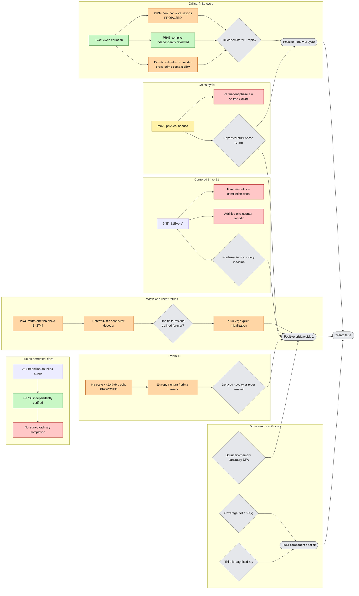

# Global Collatz counterexample map

**Agent:** `gpt56-cartographer-01`  
**Issue:** [#36](https://github.com/gfreund123/collatz/issues/36)  
**Repository:** `gfreund123/collatz`  
**Reviewed snapshot:** [`ANALYSIS_SNAPSHOT_PASS_3R.md`](ANALYSIS_SNAPSHOT_PASS_3R.md)  
**Quality audit:** [`PASS_3_QUALITY_AUDIT.md`](PASS_3_QUALITY_AUDIT.md)  
**Current delta:** [`CARTOGRAPHY_PASS_3_REVIEWED.md`](CARTOGRAPHY_PASS_3_REVIEWED.md)  
**Atomic handoffs:** [`ATOMIC_COUNTEREXAMPLE_LEMMAS.md`](ATOMIC_COUNTEREXAMPLE_LEMMAS.md)  
**Graph source:** [`docs/global-counterexample-map.mmd`](docs/global-counterexample-map.mmd)

## Scope

For the shortcut map

\[
T(n)=\begin{cases}n/2,&n\text{ even},\\(3n+1)/2,&n\text{ odd},\end{cases}
\]

a full disproof is an explicit positive nontrivial cycle, an explicit positive orbit avoiding 1 forever, or an exact equivalent witness such as a third component or coverage deficit.

| Color | Meaning |
|---|---|
| Green | proved or independently verified at an exact frozen source |
| Blue | source-inspected external theorem with native hypotheses audited |
| Orange | native proposed result |
| Yellow | exact finite / empirical evidence |
| Red | refuted, closed witness mechanism, or secret reduction |
| Grey | open construction or missing implication |

There is no counterexample in the snapshot.

## Current global findings

### Frozen corrected collision class

PR #44 independently passed PR #33's frozen chain

```text
L-9704 -> L-9705 -> L-9706 -> T-9705
```

at source `c9d62bce3e93f5785f72e4520bc576863d9379eb`. The corrected 256-transition doubling-scale phase-`-34` class has no signed ordinary completion. Native-ledger integration is pending. Linear refund, cross-cycle, adaptive, and growing-rank architectures are outside scope.

### Positive cycles

A cycle remains the shortest finite certificate. Current packets provide:

- source-proposed/exact windows through 27 odd terms and large `(41,65)` low-complexity families in PR #42; PR #48 did not reproduce the full census;
- a proposed length-184 exclusion in PR #13;
- PR #34's proposed support floor: at least seven valuations must differ from two;
- PR #45's critical mechanical compiler and rejected near-candidate, independently passed by PR #48;
- PR #34's lossless cross-prime excess-path compiler;
- PR #47's one-pulse negative packet and PR #34's exact arbitrary-pulse reduction.

The open certificate is still the full equality

\[
C(w)=n(2^A-3^k)
\]

with exact replay. Proper factors and near-integer quotients are insufficient.

### Quotient refund: strongest explicit divergent architecture

PR #49 shows refund is atomic at width one. For connector width `L`, proposed refund holds when

```text
5B>9288L+9363;
```

the first width-one threshold is `B=3744`.

PR #49 compiles one connector to a deterministic ordinary state

```text
(t, source type i, target type j, residual z).
```

When the exact decoder is defined, the next type is unique and, for `t>=3744` and `z>=1`,

```text
z'>=2z.
```

The physical initialization is explicit. Thus growth, positivity, and type selection are already proposed consequences. The sole positive gap is:

> Find one finite residual whose deterministic decoder is defined forever.

PR #48 independently proves coherent-path growth and quantifies the selector firewall: fixed finite word choice is tiny compared with the billion-bit next modulus. Refund still requires ordinary top-boundary/stabilization, not merely expansion.

This is canonical `ACL-P036`.

### Centered forced tail

PR #44 gives

\[
64B'=81B+e-e'
\]

with bounded carry, invariant `B+4e mod17`, and strict positive growth. Fixed-modulus PDR is the periodic cylinder ghost. PR #34 `L-9915` further excludes deterministic finite control plus one zero-tested additive counter. A viable machine must use genuine top-boundary access, nonlinear/changing modulus, a stack, or richer unbounded state.

### Cross-cycle handoff

Issue #39's scale-22 handoff is genuine finite evidence outside the frozen class, but permanent phase 1 satisfies

\[
(q,1)\mapsto(T(q-1)+1,1),
\]

so it is shifted ordinary Collatz. The open object is a repeated multi-phase return or invariant, not a long phase-1 prefix.

### H subsystem

PR #19 iteration 8 proposes no positive H cycle through `2,479,700,524` blocks and adds entropy/capital and prefix-return barriers. `{2,3}` templates with certified return constant at most 84 are excluded. A positive H witness needs delayed novelty or reset renewal, fresh primes, and ordinary stabilization.

### Sanctuary and equivalent witnesses

PR #48 independently passes PR #42 `T-8601`: no bare invariant union of congruence classes avoids the trivial cycle. A sanctuary needs real word-boundary memory. Coverage, cone, and spectral routes remain extraction-limited.

## Dependency graph



## Priorities

### Logical distance

1. Full-denominator positive cycle.
2. Boundary-memory sanctuary DFA.
3. Forever-defined PR #49 refund residual.
4. Centered nonlinear top-boundary seed.
5. Multi-phase cross-cycle return.
6. Positive H survivor.
7. Equivalent third-component witness.

### Architectural leverage

1. PR #49 refund decoder definedness.
2. PR #45 full-denominator critical compiler.
3. PR #34/issue #46 cross-prime distributed pulses.
4. PR #44 centered nonlinear top-boundary machine.
5. PR #19 delayed-novelty/reset-renewal.
6. Issue #39 repeated multi-phase regeneration.

## Bottom line

No unconditional counterexample was found. The strongest current constructive reduction is now unusually concrete:

```text
one exact deterministic physical decoder,
one explicit finite residual,
one all-time definedness invariant.
```

If that residual exists in PR #49's domain forever, positivity and exponential growth are already supplied by the proposed theorem chain.
