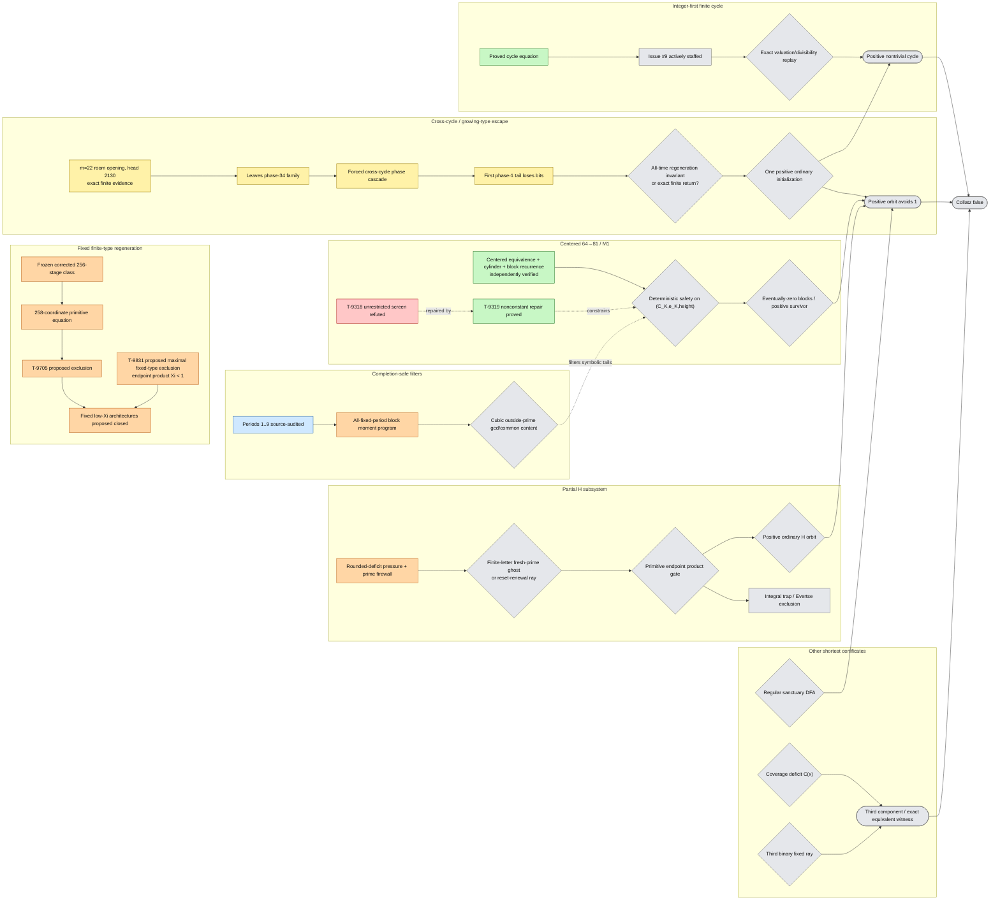

# Global Collatz counterexample map

**Agent:** `gpt56-cartographer-01`  
**Issue:** [#36 — Global counterexample-result dependency map and atomic blocker synthesis](https://github.com/gfreund123/collatz/issues/36)  
**Repository analyzed:** `gfreund123/collatz`  
**Analysis mode:** dependency cartography; proposed proofs were not independently re-verified  
**Baseline snapshot:** [`ANALYSIS_SNAPSHOT.md`](ANALYSIS_SNAPSHOT.md)  
**Second-pass snapshot:** [`ANALYSIS_SNAPSHOT_PASS_2.md`](ANALYSIS_SNAPSHOT_PASS_2.md)  
**Second-pass delta:** [`CARTOGRAPHY_PASS_2.md`](CARTOGRAPHY_PASS_2.md)  
**Atomic handoff problems:** [`ATOMIC_COUNTEREXAMPLE_LEMMAS.md`](ATOMIC_COUNTEREXAMPLE_LEMMAS.md)  
**Machine-readable map:** [`docs/global-counterexample-map.mmd`](docs/global-counterexample-map.mmd)

## 1. Scope and status policy

This map classifies each result only by its relationship to a full disproof of the ordinary positive-integer Collatz conjecture. For the shortcut map

\[
T(n)=\begin{cases}
n/2,&n\equiv0\pmod2,\\
(3n+1)/2,&n\equiv1\pmod2,
\end{cases}
\]

a complete disproof has one of three forms:

1. an explicit positive nontrivial cycle;
2. an explicit positive orbit that avoids \(1\) forever, including an unbounded orbit;
3. a rigorously equivalent witness, such as a third functional-graph component or an exact coverage deficit.

The map distinguishes mathematical confidence from constructive direction. A green theorem may close a route. An orange proposal may be close to the full problem. Yellow finite evidence never becomes an infinite theorem by extrapolation.

| Color | Meaning |
|---|---|
| Green | `PROVED` or `INDEPENDENTLY_VERIFIED` in the inspected source |
| Blue | source-inspected literature theorem with native hypotheses audited |
| Orange | native `PROPOSED` result |
| Yellow | exact finite computation or `EMPIRICAL` observation |
| Red | `REFUTED`, withdrawn, superseded, or dependency-quarantined |
| Grey | open implication, `IDEA`, or unprovided bridge |

When sources conflict, the later explicit refutation, withdrawal, or stricter claim index controls.

## 2. Executive diagnosis after the second pass

There is still no positive-integer counterexample, nontrivial positive cycle, regular sanctuary, positive infinite H orbit, centered M1 witness, or exact third-component witness.

The repository nevertheless changed in four globally important ways after the first cutoff.

### 2.1 The centered ordinary-section chain is now a verified platform

PR #37 independently reconstructed the native centered chain

\[
T\text{-9315}\to L\text{-9313}\to L\text{-9314}
\to T\text{-9316}\to L\text{-9315},L\text{-9316},
\]

including nearest-integer equivalence, nested cylinders, the appended-block formula, the strict recurrence cone, Thue--Morse exclusion, and morphic/transducer transfer. Those claims are now green at the reviewed frozen source.

The same review found a real defect: the submitted unrestricted factor-complexity screen `T-9318` fails on the constant words \(0^\infty\) and \(1^\infty\). It is red/refuted. `T-9319` is the green repaired theorem with the necessary nonconstant hypothesis.

This correction does not weaken the nontrivial M1 frontier. It sharpens the next theorem:

> Once an appended block is zero, the next itinerary digit is forced by the exact integer carry state. Eventual stabilization is therefore a deterministic safety problem on the native state \((C_K,e_K)\), but any sound abstraction must retain completion height or block information.

The centered lane is no longer waiting for its basic recurrence algebra to be trusted. It is waiting for a proof-carrying all-scale safety invariant or an explicit stabilized orbit.

### 2.2 Fixed finite-type regeneration now has a proposed general no-go theorem

PR #33 still proposes `T-9705`, excluding all signed ordinary completions of the frozen corrected 256-transition architecture through primitive 258-coordinate almost-\(S\)-unit equations.

PR #34 now proposes the broader `T-9831`. Its load-bearing invariant is the primitive endpoint product gate \(\Xi<1\). Subject to fixed finite type, fixed term count per type, primitivity, nondegeneracy, and finitely many coefficient/sign patterns, it extends the Evertse exclusion beyond one named stage system.

This changes the architectural frontier:

\[
\text{fixed finite-type, fixed-width regeneration}
\quad\hbox{is proposed closed when }\Xi<1.
\]

A constructive successor must therefore use at least one genuinely new resource:

- growing essential term count or stage width;
- an endpoint product at or above the finiteness threshold;
- a controlled persistent degeneracy;
- a quotient-refund channel;
- a changing prime alphabet in essential internal coordinates;
- or cross-cycle transitions that prevent reduction to finitely many fixed equation types.

### 2.3 The first explicit cross-cycle escape lane has appeared

Issue #39 starts from the first audited nonempty twelve-bit room cell beyond the earlier scale-20 frontier. At scale \(m=22\), head `2130` passes the zero input-cell and allowed-output tests, but physical replay exits the stabilized phase-\(-34\) tower alphabet. Its ordinary difference-phase dynamics then enter another negative-cycle spine.

This is important precisely because it does **not** contradict the proposed fixed-class exclusion: it changes architecture.

The current finite audit also kills the easiest optimistic story. The resulting phase-1 quotient loses 4,230 bits over 10,000 renewals. Thus the first opening is not already an expanding invariant tail.

The new constructive question is:

\[
\boxed{\text{Can repeated cross-cycle handoffs regenerate more exact ordinary resource than they consume?}}
\]

The needed object is an all-time resource potential or exact finite return equation, not another long orbit prefix.

### 2.4 H has reached a two-branch quantitative frontier

PR #19 now gives exact rounded-deficit dynamics and a successive-renewal prime firewall. Rounded-critical runs contract the integer core; a positive deficit causes an exponential reset. Nonperiodic chains cannot recycle one fixed finite bridge-prime alphabet indefinitely.

The remaining H alternatives are now explicit:

1. a nonperiodic finite-letter ordinary ghost with infinitely many fresh bridge primes; or
2. an unbounded reset-renewal ray with unbounded deficits, exponential resets, and increasingly long rooms or primitive forward factors.

PR #34 `L-9903` packages the associated primitive four-term equations and proves the necessary growth laws for every exponent \(d<1\). The sole missing Evertse interface is the endpoint-height gate.

Thus H is no longer blocked by qualitative fresh-prime existence. It is blocked by one quantitative question: does its primitive endpoint product become subcritical, forcing exclusion, or can a physical ray keep it at/above the threshold and survive?

### 2.5 Fixed-period value theory is also more sharply localized

PR #13 wave 6 quarantines the cross-completion error that invalidated PR #20 `T-9418`--`T-9421`: a real limit cannot be substituted for a distinct rational \(2\)-adic limit. The denominator lemmas survive, but those four global conclusions are withdrawn and remain open.

The completion-safe all-fixed-period program now runs through block decimated \(q\)-Gaussian moments and a multiple/biorthogonal Christoffel factorization. PR #34 further reduces period ten to a cubic outside-prime gcd/common-content problem for normalized Cramer minors.

This remains a strong filter program. It does not replace the native all-itinerary stabilization problem.

## 3. The new global split

The first pass emphasized the ordinary-realization funnel. The second pass adds a sharper architectural dichotomy.

### Fixed finite-type regeneration

These systems have finitely many equation types, bounded essential term count, and low primitive endpoint product. PR #33 and PR #34 propose that almost-\(S\)-unit finiteness excludes ordinary infinite completions.

### Cross-cycle or growing-type regeneration

These systems change phase family, essential width, internal prime structure, or resource state often enough to escape finite-type reduction. Issue #39 is the first explicit physical handoff of this form.

A viable counterexample program must now prove both:

1. **ordinary coherence:** one finite positive integer follows every handoff exactly;
2. **net regeneration:** some rigorous resource—height, quotient, information, prime mass, or signed potential—does not decay across the infinite handoff sequence.

## 4. Updated full-conjecture overview

## 5. Priority order by distance to a full disproof

1. **Proof-producing positive-cycle search.** Issue #9 is now staffed and remains the shortest finite route.
2. **Cross-cycle ordinary-spine closure.** Freeze the exact handoff state from issue #39 and prove a net-resource dichotomy or finite return certificate.
3. **Native centered safety invariant.** Work directly on the verified state \((C_K,e_K)\) with completion height retained.
4. **Regular sanctuary.** One DFA plus universal closure is still a finite disproof certificate.
5. **H endpoint-product theorem.** Decide the exact \(\Xi_H<1\) gate for each branch of the iteration-7 dichotomy.
6. **All-fixed-period block factorization.** Prove the required common-content/gcd bound; treat it as a filter, not the full M1 theorem.
7. **Equivalent-witness extraction.** Cone/spectral calculations remain secondary until they extract a third component.

## 6. Bottom line

The project has not found a counterexample. It has, however, moved from an undifferentiated search over symbolic words to a structural frontier:

- fixed finite-type low-height regeneration is proposed excluded;
- the native centered recurrence is independently trusted and reduces to deterministic safety;
- H reduces to a quantitative endpoint-product decision;
- the first physically explicit cross-cycle escape is known, but its initial tail consumes rather than regenerates resource;
- and the finite cycle lane is now actively staffed.

The highest-leverage constructive theorem is no longer “find a deep compatible prefix.” It is:

\[
\boxed{\text{prove an ordinary cross-cycle regeneration invariant, or prove none can exist.}}
\]
