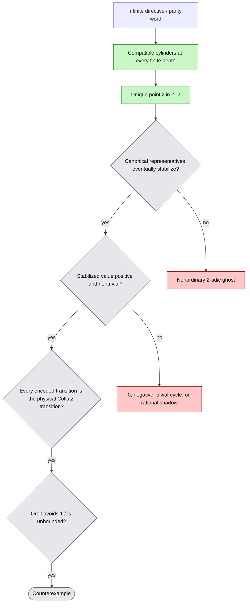

# Constructive counterexample lanes

## 4. The ordinary-realization funnel

The following is the central dependency shared by the project.

`L-9902` and `L-9904` provide the green classical backbone: finite parity words are free, every infinite parity word has one \(2\)-adic realization, and integrality/positivity is the exact symbolic obstruction. The proposed cross-direction lemma `L-9801` packages the same boundary as eventual stabilization of canonical representatives.

This funnel explains why deeper finite searches repeatedly fail to change the full-conjecture status. A computation that extends compatible prefixes without controlling stabilization only moves horizontally inside `CYL`.

## 5. Direct finite-cycle lane

### Supplied

The accelerated odd-map cycle equation is now in the proved foundation:

\[
(2^A-3^k)n_0
=
\sum_{j=0}^{k-1}3^{k-1-j}2^{A_j},
\qquad
2^A>3^k,
\]

with exact intermediate valuation and positivity requirements. The affine monoid

\[
M(u)=(k_u,A_u,C_u),\qquad
M(uv)=
(k_u+k_v,A_u+A_v,3^{k_v}C_u+2^{A_u}C_v)
\]

is the correct compressed-word interface.

`L-9906` proves no nontrivial cycle with at most six odd terms. Proposed `L-9912` additionally excludes \(m\in\{7,9,12\}\) and forces a single total exponent \(K\) for several small \(m\). The smallest stated open finite packet is \(m=8,\ K=13\), with 792 exponent compositions.

### Exact missing implication

Find one valuation word for which the right-hand side is divisible by \(2^A-3^k\), reconstruct \(n_0>0\), and independently replay every exact valuation and the return. This finite object would disprove Collatz immediately.

### Global assessment

This is the shortest logical route and bypasses all inverse-limit problems. It is computationally and arithmetically difficult, but currently under-resourced relative to much longer address-first programs.

## 6. Corrected collision / phase-\(-34\) lane

### Supplied finite and room theory

PR #3 supplies proposed exact parity-affine cylinders, large supercritical collision fibers, inverse-signature families, complete finite dyadic projection, mixed-radix transducers, tower blocks, canonical connectors, Montgomery/Newton compilation, and a corrected 256-transition stage.

For the corrected stage,

\[
z_m=R_m+2^{D_m}Y_m,\qquad
z_m^+=S_m+3^{A_m}Y_m.
\]

Proposed quotient extinction forces every signed ordinary tail eventually into one of two cases:

\[
Y_m=0
\quad\Longrightarrow\quad
S_m=R_{m+1},
\]

or

\[
Y_m=-1
\quad\Longrightarrow\quad
3^{A_m}-S_m=2^{D_{m+1}}-R_{m+1}.
\]

PR #3 and PR #34 further propose:

- one real \(C_\infty\) generating every boundary floor and tower type;
- exact real/dyadic connector addresses with doubly exponentially small positive defect;
- a two-cell collar, 84 canonical triple seams, and a nonautonomous odd-radix carry;
- completion-height collapse below \(1/275\) of dyadic precision;
- infinitely many fresh endpoint primes;
- exact boundary \(2\)- and \(3\)-adic signatures.

### Proposed class-wide exclusion

PR #33 now proposes `T-9705`, a theorem uniform over every physically overlapping directive in the frozen corrected 256-transition class.

It introduces a connector-free physical coordinate \(Z_j\) and rewrites one complete stage as

\[
2^{E_m}Z_{m+1}
=
3^{A_m}Z_m
+
\sum_{j=0}^{255}
b_{i_{m,j}}2^{U_{m,j}}3^{V_{m,j}}.
\]

After primitive normalization, a hypothetical infinite cap or co-cap tail gives 258-coordinate projective zero sums. Proposed `L-9706` checks:

- primitive gcd at most \(216\);
- 256 internal coordinates are \(\{2,3\}\)-units;
- exactly one coordinate has one sign and the rest the opposite sign, so no proper subsum vanishes;
- endpoint outside-\(\{2,3\}\) content has exponent at most
  \[
  \frac{6498}{346819}<\frac1{50};
  \]
- one coordinate has size at least \(2^{E_m}/216\);
- the projective points are pairwise distinct.

Evertse's 1984 Corollary 1 permits only finitely many such nondegenerate admissible projective zero sums, contradicting the infinitely many scales.

### Current full-problem standing

At source status, `T-9705` is **PROPOSED**, not independently verified. But dependency cartography must honor its claimed implication:

> The frozen corrected 256-transition class has no signed ordinary completion and therefore no positive marked Collatz initialization.

The room, seam, and fresh-prime results remain valuable as structural anatomy and as alternative checks, but they no longer form an open constructive path unless `T-9705` is narrowed or refuted.

### Exact constructive successor

A new collision construction must change the architecture so that at least one of the following fails:

1. eventual cap/co-cap quotient dichotomy;
2. fixed finite coordinate count;
3. a fixed finite \(S\) for all internal coordinates;
4. uniform nondegeneracy/proper-subsum exclusion;
5. outside-prime endpoint height exponent \(d<1\);
6. pairwise projective distinctness;
7. direct physical-coordinate reduction.

A variable-width stage, an essential growing internal prime alphabet, a controlled degenerate subsum, or a quotient-refund channel are examples of genuine escape mechanisms. Merely choosing a different word inside the frozen class is not.

### Global assessment

The repository has, at proposed level, completed the product-formula attack anticipated by the earlier room analysis for this exact architecture. The next global question is no longer “which of the 84 seams survives?” but “what is the maximal class of expanding Collatz architectures covered by the almost-\(S\)-unit exclusion, and what minimal structural change escapes it?”

## 7. The \(64\to81\) centered/M1 lane

### Exact target

The branch-4 M1 formulation asks for a positive ordinary integer in the binary \(64\to81\) survivor attractor. The centered PR #16 equivalence proposes that a nontrivial ordinary integral orbit exists exactly when some \(\xi>0\) satisfies

\[
\left\|\xi(81/64)^n\right\|\le \frac1{81}
\quad\text{for every }n\ge0.
\]

The native cylinder formulation says an itinerary selects an ordinary integer exactly when its appended base-64 blocks \(q_K\) are eventually zero.

### Supplied filters

The project proposes or imports:

- a universal ordinary-itinerary factor-complexity slope at least
  \[
  \frac{\log 64}{\log(81/64)}
  =17.654847\ldots;
  \]
- exact copied-prefix and recurrence-cone inequalities;
- exclusion of Thue–Morse, many morphic encodings, and small finite-state encodings;
- irrationality of constant and eventually constant tails;
- source-audited irrationality of every positive eventually periodic tail of minimal period \(1,\dots,9\);
- period ten reduced to one prescribed special-vector / combined-moment height problem;
- finite words all physically realizable, so no finite forbidden-block grammar can settle the all-scale problem;
- support in every affine multiplicative shell for any rational bounded-digit completion.

### Quarantine

`R-9808` identifies a false bridge identity \(81/64=(3/2)^4\). The fixed four-phase full-\(3/2\) route is dependency-quarantined; direct native-\(81/64\) results survive only when they have an independent derivation. The independently reconstructed ADEL chain in PR #32 remains useful at its frozen source commit, but downstream claims must not import the invalid four-phase bridge.

A separate historical denominator descent in PR #20 is also withdrawn after it conflated rational \(2\)-adic tails with distinct positive real shadows (`R-9809`).

### Exact missing implication

Construct one nontrivial itinerary whose appended blocks are eventually zero, equivalently one \(\xi\) in the centered radius-\(1/81\) set. The opposite theorem—nonzero appended blocks infinitely often for every nontrivial itinerary—would close this counterexample route negatively.

### Global assessment

Further measure-level equidistribution is secondary to the ordinary-section problem. The live object is the one-root all-scale carry recurrence, not the distribution of finite survivor sets.

## 8. Partial H subsystem lane

A positive infinite H-orbit lifts explicitly to a genuine nonconvergent shortcut-Collatz orbit through \(N=8n+1\). Thus one positive ordinary H survivor is a full counterexample.

### Supplied

PR #19 proposes:

- exact H block maps, arithmetic cylinders, ghosts, carries, toll identities, and completion-height criteria;
- a separated ghost IFS and critical/subcritical split;
- a repaired boundary classification showing no positive integer hides on a nongenuine closure boundary;
- exact dual renewal equations
  \[
  3^aX+1=8^RU,\qquad 4^bY+1=9^RU;
  \]
- an integral renewal-height sign law;
- exact successive-core compatibility;
- pressure and critical-core capacity estimates.

Cross-direction results close several candidate return architectures:

- nested `10/30` suffix schedules select nonordinary \(2\)-adic seeds;
- any finite suffix family with robust zero-interface descent has no ordinary nonnegative nested seed;
- the raw `{30,60,70}` return has positive drift but no ordinary point by integer packing;
- phase-only and bounded-carry closures are insufficient.

The latest proposed fresh-prime dichotomy says a nonperiodic infinite exact H chain cannot reuse one finite prime support forever; globally new prime mass must diverge, although it may be too sparse for the current pressure budget.

### Exact missing implication

Positive route: construct one itinerary whose least cylinder representatives stabilize to a positive integer and whose H orbit remains defined forever.

Negative route: prove an integral finite-trap theorem in the subcritical renewal regime, or a quantitative \(S\)-unit/order theorem that converts fresh-prime mass into a contradiction or repeated complete state.

### Global assessment

The H and corrected-collision lanes now share the same shape: shrinking rooms, low-height representatives, dual-place valuations, and forced fresh primes. A reusable theorem on nonperiodic affine recurrences in shrinking \(S\)-arithmetic rooms could advance both.

## 9. Regular sanctuary and finite safety lanes

A nonempty regular language \(L\) of canonical positive binary words with

\[
T(L)\subseteq L,\qquad L\cap\{1,2\}=\varnothing
\]

is a finite, machine-checkable counterexample certificate.

PR #12 supplies exact shortcut transducers, product-graph verification, certificate checking, and bounded synthesis laboratories. It does not supply a sanctuary. Its strongest current structured result excludes one suffix gate and proves that concrete CEGIS clauses cover an exponentially tiny fraction of reset-pattern normal forms.

PR #14 proposes that each fixed-depth safety language is cofinite, with one inevitable two-state cyclic tail and an acyclic sink-stripped boundary. Therefore, a widening that preserves eventual acceptance of all sufficiently long canonical words cannot be a sanctuary.

Cross-direction work additionally rules out a global exact zero-reset router and shows why regular acceptors alone do not provide the synchronizing arithmetic router needed by survivor cylinders.

### Exact missing implication

Exhibit one DFA and an exact closure certificate, or derive a generic symbolic transition-cube theorem strong enough to eliminate or construct sanctuary languages beyond the currently structured suffix families.

### Global assessment

This remains a direct finite-certificate route. Bounded solver failure is not evidence of nonexistence, but an explicit DFA would settle the conjecture immediately.

## 10. Conditioned \(3\)-adic resonance lane

Issue #8 freezes the exact accelerated affine state

\[
A_{j+1}=A_j+a_j,\qquad
C_{j+1}=3C_j+2^{A_j},\qquad
2^{A_n}S^n(x)=3^nx+C_n.
\]

It proposes conditioning on positive-drift valuation tails and testing residue spectra with exact tilted transfer matrices. No experiment or theorem currently constructs a coherent ordinary orbit.

The decisive acceptance condition is not a persistent finite spectral mode. It is a nested compatible residue path whose least positive representatives eventually stabilize to one ordinary positive integer and whose exact valuations replay forever.

### Global assessment

This is currently an idea with a correct finite state recurrence. It should not receive large computation until a stabilization invariant or a control map with known divergence is built into the experiment.

## 11. Foundry lane

The diagonal foundry proposes that every strictly causal parity-digit operator \(E\) has one \(2\)-adic solution \(\alpha_E\), and that a uniformly supercritical operator with \(\alpha_E\in\mathbb Z_{>0}\) would give an unbounded orbit.

The same packet then proposes its own collapse:

- finite-state tail feedback with an integral solution yields eventual periodicity/cycle behavior;
- for any strictly causal operator, an ordinary integer has finite binary support, so the tail output is the open-loop word \(E(u0^\omega)\).

Thus, for ordinary targets, feedback does not remove the open-loop realization problem. The finite-state foundry is not an independent counterexample route. One-counter or pushdown tail families may still provide a new open-loop language, but they return to the same ordinary-realization funnel.
